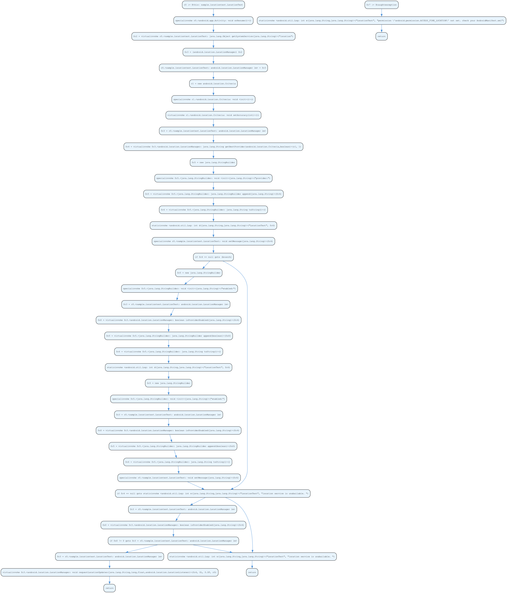

# CS443 Lab 2 — Soot Android Static Analysis Environment

A complete, working Soot-based static analysis environment for analyzing Android APKs on macOS. The tool loads `demo.apk`, generates control-flow graphs (CFGs), and scans for sensitive API usage.

---

## Verified Environment

| Component | Version | Status |
|---|---|---|
| Java JDK | OpenJDK 21.0.5 (Temurin) | ✅ Pre-installed |
| Maven | 3.9.11 | ✅ Pre-installed |
| Graphviz | 14.1.2 | ✅ Pre-installed |
| Homebrew | 5.1.0 | ✅ Pre-installed |
| Android SDK platforms | android-34 | ✅ Installed |
| Soot | 4.5.0 | ✅ Maven dependency |

---

## Project Structure

```
Lab 2/
├── demo.apk                 ← Your APK (the subject of analysis)
├── sensitive_apis.csv        ← 32,438 rows of sensitive API definitions
├── run_analysis.sh           ← One-click build & run script
├── convert_cfg.py            ← DOT → PNG converter
├── soot-analysis/            ← Maven project
│   ├── pom.xml               ← Dependencies (Soot 4.5.0, OpenCSV, SLF4J)
│   └── src/main/java/cs443/lab2/
│       └── Main.java         ← Core analysis code
├── cfg_output/               ← Generated .dot CFG files (15 files)
├── cfg_png/                  ← Visualized CFGs as PNG/PDF
└── sensitive_apis.txt        ← Sensitive API scan results
```

---

## Analysis Results

### Classes & Methods Found

```
Classes analyzed : 7
Methods analyzed : 15
CFGs generated   : 15
Sensitive hits   : 10
```

### Sensitive API Detections

| API | Frequency | Residing Function |
|---|---|---|
| `android.location.LocationManager.isProviderEnabled` | 3 | `LocationTest.onResume` |
| `android.location.LocationManager.requestLocationUpdates` | 1 | `LocationTest.onResume` |
| `android.location.LocationManager.getBestProvider` | 1 | `LocationTest.onResume` |
| `android.location.LocationManager.removeUpdates` | 1 | `LocationTest.onPause` |
| `android.app.Activity.getSystemService` | 1 | `LocationTest.onResume` |
| `android.app.Activity.onCreate` | 1 | `LocationTest.onCreate` |
| `android.app.Activity.setContentView` | 1 | `LocationTest.onCreate` |
| `android.app.Activity.findViewById` | 1 | `LocationTest.setMessage` |
| `android.widget.TextView.setText` | 1 | `LocationTest.setMessage` |
| `android.app.Activity.<init>` | 1 | `LocationTest.<init>` |

### Generated CFG — `LocationTest.onResume()`



---

## How to Run

### Quick Start (one command)

```bash
./run_analysis.sh
```

### Manual Steps

```bash
# 1. Build the Maven project
cd soot-analysis
mvn clean package -DskipTests -q

# 2. Run the analysis
cd ..
java -jar soot-analysis/target/soot-analysis-1.0-SNAPSHOT.jar \
    --apk demo.apk \
    --android-platforms ~/Library/Android/sdk/platforms \
    --sensitive-apis sensitive_apis.csv \
    --cfg-output cfg_output \
    --sensitive-output sensitive_apis.txt

# 3. Convert CFGs to PNG/PDF
./convert_cfg.py                    # Convert ALL
./convert_cfg.py cfg_output/some_file.dot  # Convert ONE
```

### CLI Flags

| Flag | Description | Default |
|---|---|---|
| `--apk` | Path to APK file | `../demo.apk` |
| `--android-platforms` | Android SDK platforms directory | `~/Library/Android/sdk/platforms` |
| `--sensitive-apis` | Path to sensitive APIs CSV | `../sensitive_apis.csv` |
| `--cfg-output` | Output dir for .dot files | `../cfg_output/` |
| `--sensitive-output` | Output path for API report | `../sensitive_apis.txt` |

---

## Output Files

| File | Description |
|---|---|
| `cfg_output/*.dot` | Control Flow Graph for each method (15 files) |
| `cfg_png/*.png` | Rendered CFG images (after running `convert_cfg.py`) |
| `cfg_png/*.pdf` | Rendered CFG PDFs (after running `convert_cfg.py`) |
| `sensitive_apis.txt` | `API_name : frequency : [residing functions]` format |

---

## Key Code Areas to Extend

The `Main.java` (`soot-analysis/src/main/java/cs443/lab2/Main.java`) is organized into clearly labeled sections:

1. **`configureSoot()`** — Modify Soot options (add call graph, change analysis scope)
2. **`exportCfgAsDot()`** — Customize DOT output (colors, labels, annotations)
3. **`scanForSensitiveApis()`** — Add more sophisticated matching or permission tracking
4. **`runAnalysis()`** — Add additional analysis passes

---

## Tested ✅

- [x] Maven project builds cleanly
- [x] Soot loads `demo.apk` and resolves 7 application classes
- [x] 15 CFG `.dot` files generated in `cfg_output/`
- [x] 10 sensitive API calls detected and exported to `sensitive_apis.txt`
- [x] CFG converted to PNG via Graphviz
